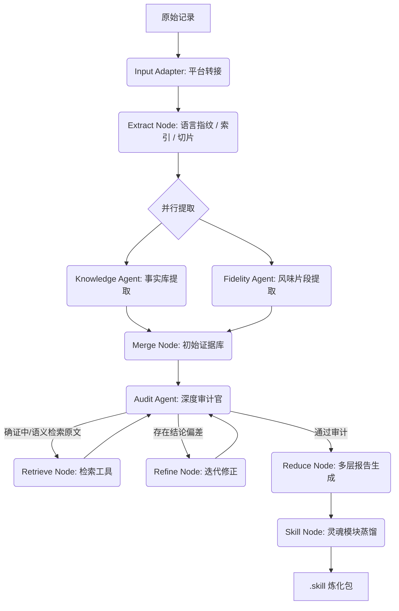

# 群友炼化机

> 即刻采集因果，顷刻炼化神魂。


## 项目简介

群友炼化机是一套基于 **LangGraph** 的聊天记录分析与人格技能蒸馏工具。它会从聊天记录中提取目标人物的：

- 客观事实
- 行为模式
- 语言风格
- 关系张力
- 记忆时间线
- 代表性原话

最后输出一套可用于后续角色模拟 / 人物复现的技能包。

当前架构有三个关键层：

1. **输入适配层**
   - 不同平台原始记录先转成统一消息结构
   - 当前内置 QQ
   - 后续可扩展微信 / Discord / Telegram
2. **本地检索层**
   - 高价值原话候选筛选
   - 语义审计检索
   - 本地消息索引与 embedding
3. **大模型理解层**
   - 证据提取
   - 证据归并
   - 推断、审计、写作、技能蒸馏

## 当前能力

### 1. 输入适配层

当前内置：

- QQ JSON 适配器

扩展方式：

- 新平台只需要新增 adapter，例如：
  - `weixin_adapter.py`
  - `discord_adapter.py`
  - `telegram_adapter.py`
- 将原始记录映射为统一消息结构后，下游 pipeline 无需重写

### 2. 本地语义检索

当前支持两种本地 embedding 方式：

#### 方案 A：内置 Embedding

默认推荐。

特点：

- 不依赖 Ollama
- 不依赖自己起服务
- 不依赖额外下载模型
- 开箱即用

当前实现是一个内置的 hash embedding，用于：

- 高价值原话候选筛选
- 审计语义检索
- 候选去重与相似度搜索

#### 方案 B：Ollama Embedding

可选增强。

特点：

- 语义效果通常更强
- 支持自动检查本地模型
- 本地缺模型时可自动拉取

例如可使用：

- `qwen3-embedding:0.6b`

### 3. 大模型分析

当前保留大参数模型负责：

- `knowledge` 证据提取
- `merge` 证据归并
- `reduce` 多层报告生成
- `skill` 总控技能文件生成

当前 `fidelity` 原话提取支持两种模式：

- **本地 Ollama fidelity**
  - 推荐模型：`qwen3:4b`
  - 每个 chunk 本地提取 30-50 条高价值目标人物对话
  - 自动总结必要上下文
- **线上主模型 fidelity**
  - 若未配置本地 fidelity，或本地 Ollama 不可用，会自动回退

也就是说：

- 本地 embedding 主要负责“找材料”
- fidelity 可以本地先做“摘原话”
- 大模型仍然负责更重的“理解人”

## 炼化流程



## 安装

确保 Python 3.10+ 环境并安装依赖：

```bash
pip install -r requirements.txt
```

如果你只使用 CLI，可按需安装精简依赖：

```bash
pip install requests jieba langgraph typing-extensions
```

## 启动方式

### GUI 模式

```bash
python profiler_gui.py
```

使用流程：

1. 选择聊天记录 JSON 文件
2. 输入目标人物 ID（当前主要是 QQ UIN）
3. 配置 API 与高级参数
4. 启动分析

### CLI 模式

```bash
python scripts/run_pipeline.py \
  --files chat1.json chat2.json \
  --target-uin 1778531385 \
  --api-key sk-xxxx \
  --api-base https://openrouter.ai/api/v1 \
  --model google/gemini-2.0-flash-001
```

预估资源：

```bash
python scripts/run_pipeline.py \
  --files chat.json \
  --target-uin 1778531385 \
  --estimate
```

断点续传：

```bash
python scripts/run_pipeline.py --resume logs/1778531385-20240101_120000
```

导出脱水文本：

```bash
python scripts/run_pipeline.py \
  --files chat.json \
  --target-uin 1778531385 \
  --export-txt output.txt
```

## 本地 embedding 配置

### 配置 1：内置 Embedding

无需任何服务。

```json
{
  "embedding_enabled": true,
  "embedding_provider": "builtin",
  "embedding_model": "builtin-hash-384",
  "builtin_embedding_dim": 384,
  "semantic_retrieval_enabled": true
}
```

适合：

- 开箱即用
- 机器环境简单
- 不想额外部署 Ollama

### 配置 2：Ollama Embedding

如需更强的本地语义效果：

```json
{
  "embedding_enabled": true,
  "embedding_provider": "ollama",
  "embedding_api_base": "http://localhost:11434",
  "embedding_model": "qwen3-embedding:0.6b",
  "auto_pull_local_models": true
}
```

说明：

- 若本地缺少该模型，会自动尝试拉取
- 若拉取失败，会优雅回退，不阻断整体分析流程

## Fidelity 配置

### 方案 A：本地 Ollama Fidelity

推荐。

```json
{
  "fidelity_provider": "ollama",
  "fidelity_api_base": "http://localhost:11434",
  "fidelity_model": "qwen3:4b",
  "fidelity_timeout": 180,
  "fidelity_temperature": 0.2,
  "fidelity_candidate_min": 30,
  "fidelity_candidate_max": 50,
  "auto_pull_fidelity_models": true
}
```

特点：

- 每个 chunk 本地提取高价值目标人物对话
- 目标输出 30-50 条高价值记录
- 本地模型不可用时自动回退到线上主模型

### 方案 B：线上主模型 Fidelity

```json
{
  "fidelity_provider": "remote"
}
```

特点：

- 行为与旧版一致
- 每个 chunk 仍会产生一次远程 fidelity 调用

## 预估成本说明

GUI / CLI 的预估口径当前是：

- **计入**：远程 LLM 输入 / 输出 token 成本
- **不计入**：
  - 本地 embedding
  - 本地语义检索
  - 本地 CPU / GPU / 电费

因此启用本地检索后：

- 远程美元成本更接近真实 API 支付成本
- 总耗时仍然会受到本地 embedding 和本地检索影响

## 输出产物

在 `skills/immortals/<目标ID>/skill/` 目录下，会生成：

- `SKILL.md`
- `objective.md`
- `inference.md`
- `behavior.md`
- `chathistory.md`
- `memory.md`
- `style.md`
- `evolution.md`

同时在 `logs/` 下会保存：

- 全景证据库草稿
- 审计意见
- 搜索 / 语义检索结果
- 高价值原话候选池
- 消息级索引
- embedding 缓存
- checkpoint

## 项目结构

```text
group-member-unbox/
├── SKILL.md
├── profiler_gui.py
├── config.json.example
├── requirements.txt
├── scripts/
│   └── run_pipeline.py
├── references/
│   ├── architecture.md
│   └── local_retrieval_upgrade_plan.md
├── core/
│   ├── config.py
│   ├── data_processor.py
│   ├── input_adapters/
│   ├── retrieval/
│   └── pipeline/
├── gui/
├── prompts/
├── skills/
└── logs/
```

## 技术亮点

- 动态证据检索：审计时优先使用本地语义检索，失败时回退字符串搜索
- 内置本地 Embedding：默认无需起服务
- 输入适配层：后续接平台只加 adapter，不重写 pipeline
- 语言指纹分析：基于 `jieba` 的词频与语气指纹
- 状态机闭环：支持断点续传、审计、修正、再审计

## 法律与伦理声明

禁止将炼化产物用于冒充、诈骗、骚扰或其他违法用途。

本工具仅用于：

- 技术研究
- 人格档案整理
- 历史记录分析
- 数字记忆存档
