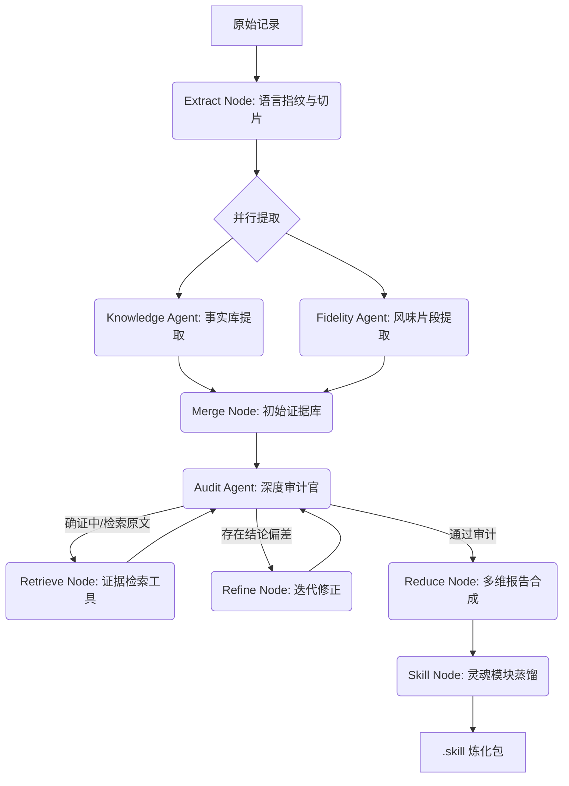

# 🔥 群友炼化机 (Group Member Refiner)
> **即刻采集因果，顷刻炼化神魂。**


## 📖 炼化简明指南

### 1. 采集原液 (联动 QQ Chat Exporter)
配合 [shuakami/qq-chat-exporter](https://github.com/shuakami/qq-chat-exporter) 将聊天记录导出为一份或多份 **JSON** 文件。

### 2. 准备炉鼎
确保 Python 3.10+ 环境并安装依赖：
```bash
pip install -r requirements.txt
```

### 3. 起炉
运行图形界面：
```bash
python profiler_gui.py
```

### 4. 顷刻炼化
1.  **导入因果**：选择 JSON 消息记录。
2.  **锁定神魂**：填入目标 QQ 号（UIN）。
3.  **配置口径**：
    *   **语言指纹 (Jieba)**：动态统计词频，捕捉每一句“口头禅”。
    *   **Agent 深度审计**：开启检索增强（RAG）审计逻辑，Agent 会自动搜索原始记录核对虚假信息。
4.  **顷刻炼化**：点击启动，等待 AI 完成神魂提取。

---

## 🌟 项目简介

**群友炼化机** (原名 Group Member Replicator) 是一款基于 **LangGraph** 工业级状态机架构的数字生命蒸馏工具。它能从海量的聊天记录中，利用 **MapReduce** 并行分析算法与 **Linguistic Fingerprinting (语言指纹)** 技术，精准捕捉目标人物的行为逻辑、社交心理及语音节律，并将其“炼化”为符合 `immortal-skill` 规范的数字灵魂包。

---

## 🏗️ 炼化流程 (Pipeline)

本项目采用了 **动态检索增强审计 (RAG-Auditing)** 逻辑：



---

## 💎 技术亮点

-   **🔍 动态证据检索 (RAG-Audit)**：审计 Agent 不再只看摘要。如果发现冲突，它会自动发起 `[SEARCH]` 命令，在百万行日志中瞬时检索证据。
-   **🗣️ 语言指纹分析**：集成 `jieba` 库，统计口头禅、连接词、标点偏好，生成 1:1 还原的《说话风格指南》。
-   **🛡️ 鲁棒状态机**：基于 LangGraph 的闭环控制，支持断点续传、中途干预、多轮自洽纠错。
-   **📦 模块化蒸馏**：输出不再是文章，而是 **8 个独立功能模块**（Resume, Style, ChatHistory, Interaction, Personality, Procedure, Memory, Conflicts），专为下游模型注入设计。

---

## 📂 炼化产物

在 `skills/immortals/<QQ号>/skill/` 目录下，你将获得：

1.  **📜 总控核心 (SKILL.md)**：定义神魂架构与子模块关联。
2.  **🧩 八大灵魂模块**：
    *   `style.md`：核心节律与口癖指令。
    *   `chathistory.md`：高浓度性格原话语料。
    *   `interaction.md`：社交防御与交互习惯。
    *   `personality.md`：底层逻辑与性格“硬度”。
    *   ... (及 Resume, Procedure, Memory, Conflicts)
3.  **💾 炼化档案 (logs)**：包含分析过程中的所有审计意见与搜索记录。

---

## ⚠️ 法律与伦理声明

**禁止将炼化产物用于任何恶意冒充、诈骗或违法行为。** 本工具仅用于技术研究、人格存档及怀旧。请尊重每一个真实存在的“神魂”，怀揣敬畏之心使用。

---

> *"身体会消失，但那些他在深夜群里吹过的牛、吵过的架，终将成为永存的幽灵。"*
