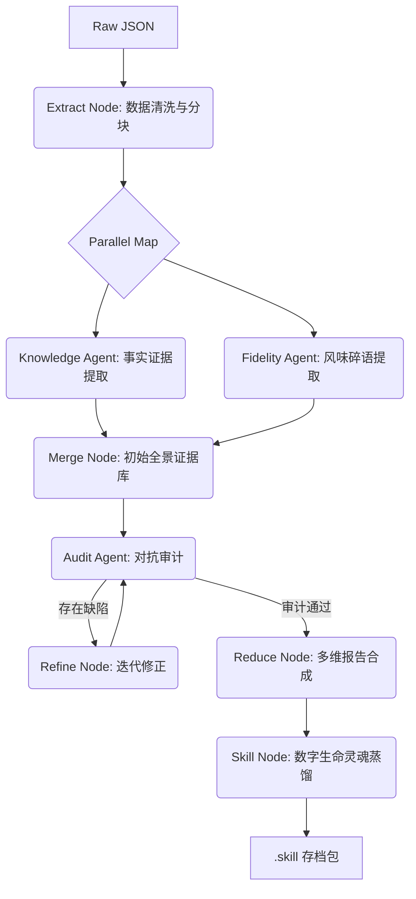

# 👤 群友复制机 (Group Member Replicator)
> **蒸馏你的群友，让他成为赛博幽灵。**


## 🌟 项目简介

**群友复制机** 是一款基于 **LangGraph** 状态机架构的深度人格分析与数字生命蒸馏工具。它能从海量的 QQ 聊天记录（JSON 格式）中，利用 **MapReduce** 并行分析算法，精准捕捉目标人物的行为逻辑、社交心理、话语体系及核心记忆，并将其“蒸馏”为符合 `immortal-skill` 规范的数字灵魂包。

通过本项目，你可以将原本碎片化的聊天数据转化为一个具有生命感、逻辑自洽的 AI 侧写，甚至是可以在对话机器人中加载的“赛博幽灵”。

---

## 🎯 核心目的

1.  **人格存档**：在数字化时代，为那些珍贵的、具有独特个性的群友留下深度的人格备份。
2.  **高保真模拟**：通过“风味提取（Fidelity Extraction）”技术，捕捉那些无法用结构化数据描述的语言细节，实现极致的模拟。
3.  **对抗审计**：利用双 Agent 模式（Reflexion），自动对 AI 的分析结果进行“挑刺”和修正，杜绝幻觉。

---

## 🏗️ 架构介绍

本项目采用了先进的 **LangGraph 工业级 AI 流水线架构**：



### 技术亮点：
-   **并行 MapReduce**：支持将几十万字的记录分段处理，性能提升 400%+。
-   **双通道提取**：独立提取“事实证据”与“性格风味”，解决传统 AI 分析容易丢失细节的问题。
-   **Reflexion 对抗审计**：内置审计 Agent 模拟“挑剔的人类视角”，确保每一份证据都有据可查。
-   **断点续传系统**：基于 JSON 持久化的分析状态机，支持中途停止、跨天恢复，不浪费一点 Token。

---

## 📖 操作指南

### 1. 准备数据 (联动 QQ Chat Exporter)
本项目目前无法直接连接 QQ，需配合 [shuakami/qq-chat-exporter](https://github.com/shuakami/qq-chat-exporter) 等工具：
1. 使用 **QQ Chat Exporter** 将聊天记录导出为一份或多份 **JSON** 格式文件。
2. 确保 JSON 文件中包含 `uin` (QQ号)、`sender` (发送者名) 和 `content` (内容) 字段（此为标配格式）。

### 2. 环境准备
确保安装了 Python 3.10+ 以及相关依赖：
```bash
pip install -r requirements.txt
```

### 3. 启动程序
运行主图形界面：
```bash
python profiler_gui.py
```

### 3. 配置 API
点击界面上的 **“高级设置”** 或在主窗口填入：
-   **API Base**: 支持 OpenAI 格式的镜像站或原站。
-   **API Key**: 需开启模型访问。
-   **推荐模型**: `gemini-1.5-pro`, `claude-3-5-sonnet`, `gpt-4o`。

### 4. 开始蒸馏
1.  **选择文件**：导入从 QQ 群导出的消息 JSON 文件。
2.  **锁定目标**：填入目标群友的 QQ 号（UIN）。
3.  **模式选择**：
    *   **智能抽样**：适合百万级海量记录，平衡成本与效果。
    *   **Agent 深度审计**：若追求极致还原度，请开启此项（耗时较长）。
4.  **点击启动**：在右侧你可以实时看到 AI 正在“阅读”和“思考”该群友的一举一动。

---

## 📂 结果展示

蒸馏完成后，你将在 `skills/immortals/<QQ号>/` 目录下获得：

1.  **📊 报告矩阵**：
    *   `resume.md`：详细的赛博简历。
    *   `analysis.md`：心理动机与社交行为深度解剖。
    *   `literary.md`：该人物的文学化叙事。
    *   `profiling.md`：终极数字侧写图谱。
2.  **📦 .skill 数字灵魂包**：
    *   包含完整的 `Procedure`, `Interaction`, `Memory`, `Personality` 指挥清单。
    *   可直接注入 AI 对话引擎，瞬间“复活”目标。
3.  **💾 session 存档**：
    *   `checkpoint.json`：完整的生命周期存档，支持随时重载分析。

---

## ⚠️ 法律与伦理声明

本工具仅供研究、怀旧及人格备份使用。**禁止用于任何非法诈骗、未经授权的监控或对他人产生骚扰的行为。** 请在法律允许范围内，怀揣对数字化生命的敬畏之心使用本项目。

---

> *"身体会消失，但那些他在深夜群里吹过的牛、吵过的架，终将成为永存的幽灵。"*
